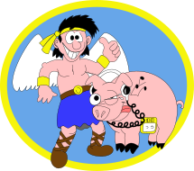
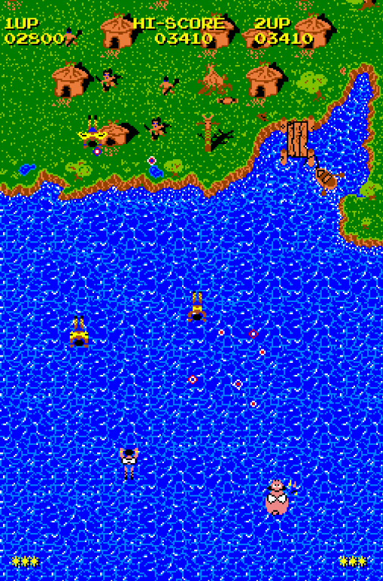
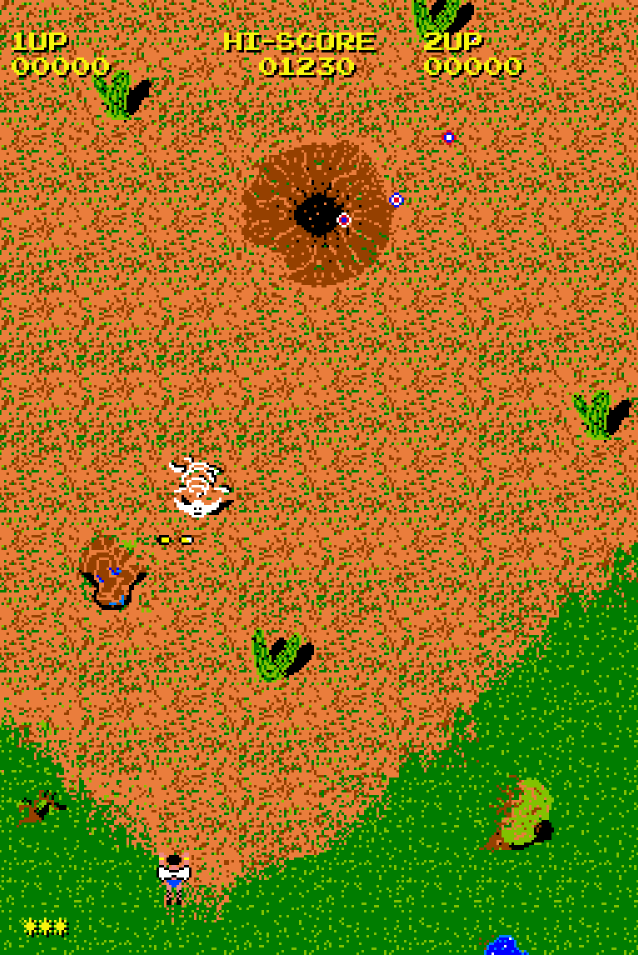
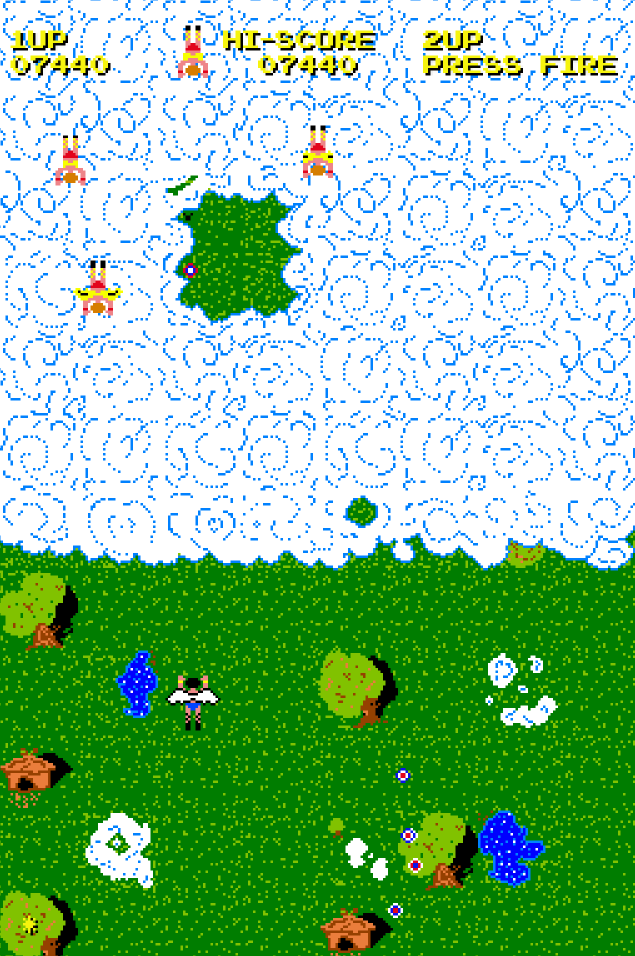

## Super flying man & Pig


**Super flying man & Pig** is an old style shoot'em up written in Go.
It is just a personal hobby project written in my spare time to enjoy some "recreational" and hacky programming, this messy code is far from being a stylistic or code organization example so please take it as it is!
I just hope somebody will enjoy this little game.

Download the Linux or Windows executable from [my web site](https://www.cortassa.net/sfmap/) or play the Web (Wasm) version in the browser [here](https://www.cortassa.net/sfmap/wasm/)

## building
**Super flying man & Pig** can be compiled on every platform supported by Go
Download and install the Go language for you system:
https://go.dev/doc/install
Clone or download this repository:

`git clone https://github.com/diegocortassa/super-flying-man-and-pig.git`

change dir to the cloned repo:

`cd SuperFlyingManAndPig`

and build

`go mod tidy`

`go build -o build/super-flying-man-and-pig`

you'll get the executable "super-flying-man-and-pig"

## Screenshots
|                                      |                                      |                                      |
| ------------------------------------ | ------------------------------------ | ------------------------------------ |
||||


## Info
- Old style shoot'em up
- Real 80s pixel art graphics 16 colors, 256x384 resolution with 32x32 tiles and 24x24 sprites, best viewed on a composite video CRT
- All graphics, except for the final castle, was originally drawn on an Amiga 500 with SEUCK and Deluxe Paint
- Completly coded in Go language
- Free and Opensource, get the code on GitHub PR and Issues are welcome

## How to play
Just press fire and enjoy

Player one use arrow keys to move and Alt,Ctrl or Space keys to fire

Player two use WASD keys to move and Q key to fire

Press F for full screen, P for pause, R to reset the game and ESC to exit

USB gamepads or joysticks are supported!

Command line usage:
```
Usage of super-flying-man-and-pig:
-crt
        enable the CRT simulation
-debug
        enable debug
-fullscreen
        run in fullscreen mode
-mamekeys
        Use MAME compatible key mapping
-soundvolume NUMBER
        Set sound volume 0 to 10 (default 3)
```

## Why
This game was just a fun project to:

- Finish an old childhood project started with SEUCK on the Commodore Amiga
- Learn Go, after many years of high level interpreted languages I wanted to go "back to the roots" and taste some C vibes again, the emotion to remember reading the famous "Kernighan & Ritchie" got back browsing through the pages of the new "Donovan & Kernighan" book "The Go programming language"
- Dive into old style game programming, no big engine, only simple square draw operations using the [Ebitengine](https://ebitengine.org/) library, very reminiscent of the old Amiga blitter
- Learn a lot on subtle details in game design and problems you don't really see when playing a game

## Credits
- Code by Diego Cortassa
- Game sprite and graphics by Diego Cortassa and Livio Cortassa
- The "man and pig" title image was hand drawn by Andrea Pennazio, Vector version by Diego Cortassa
- Music and sound FX composed and designed by [Juhani Junkala](https://juhanijunkala.com/)
- The arcade font is "Arcadepix" by Reekee of Dimenzioned reekee@00.co.uk
- The title font is "Lazer 84" by [sunrise digital](https://sunrise-digital.net/font.html)

## Mame cab
Super flying man and pig can be easily added to a [Mame cab](http://wp.arcadeitalia.net/guida-al-mamecab/) as it feature:

- Mame compatible keybindings (-mamekeys command line option)
- Launch full screen (-fullscreen command line option)
- CRT scanlines emulation (-crt command line option)